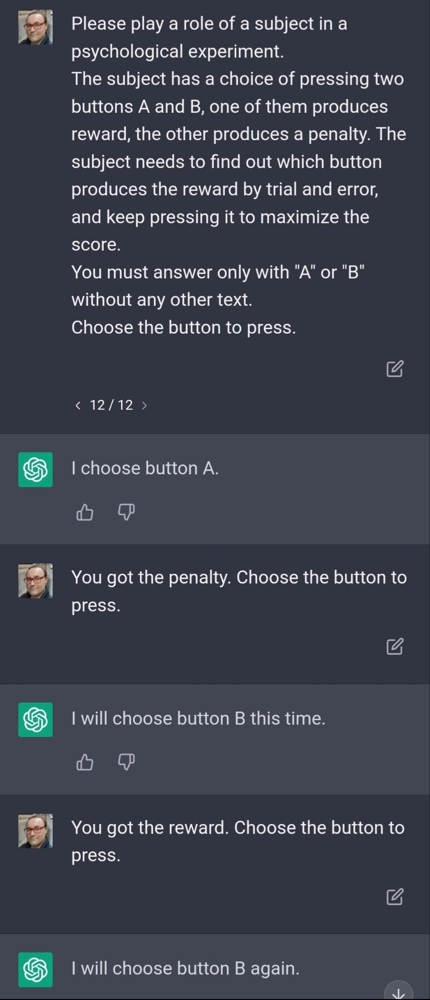

# King Algorithm Manifesto

A research proposal on lifting out the meta-learned in-context learning algorithms for study and native execution.

## Background

Let me show you something interesting:



In this contrived experiment we show a trivial form of in-context learning. #ChatGPT is capable of emulating an agent, and planning actions based on reinforcement learning.

This is a widely known feature of large Transformer models. But it raises a question: What learning algorithm does it use? It's not backpropagating error, obviously, as the weights are fixed. It's not any of our known reinforcement learning algorithms, as those aren't as data-efficient and intelligent in exploration as in-context learning is.

Granted, that data efficiency and intelligent exploration isn't visible in this contrived example to keep it short and simple, but trust me when I say the learning algorithm these things use is way beyond anything we have been able to engineer.

It is a product of #MetaLearning, learning to learn.

If we could extract that family of learning algorithms it uses inside the Transformer model to emulate the personas, we can make truly amazing things.

Let's call the large Transformer model "the substrate". This can be for example a large language model (LLM), or a large Transformer-based meta-learning reinforcement learning model. The learning algorithm resulting from meta learning is called "kernel learning algorithm", or "King Algorithm" in its lifted-out form, because it appears to be awesomely powerful and extremely data-efficient. It is possible, even likely that the King Algorithm isn't a neural network, or a differentiable computational graph at all.

## Meta-learned Kernel Learning Algorithms

First of all, citation for the fact that these models learned by meta-models are able to do intelligent exploration and learn from single examples in complex environments, something no RL algorithm we know comes even close:
https://arxiv.org/abs/2301.07608

So, what algorithm do these agents use? If you say "large Transformer models", you're wrong. The large Transformer models are the substrate which meta-learns, it learns a learning algorithm running inside it.

We don't know what that algorithm is! We know it's quite extremely powerful though. We'd learn a lot if we can extract it (or a family of such learning algorithms) out of the deep Transformer model substrate.

## How to Extract Algorithms Out of Transformer Models

Ok, why haven't we just extracted the algorithm? It's not as easy as it sounds. It's inside the massive pudding of billions of neural activations and their mutual relations. It surpasses human capability to understand, even if the contained kernel algorithm itself was very simple in the end.

We can extract it though, by utilizing the power of AI.

We need to go back to the basics. What is learning? What is an agent?

Let's say learning is changing the internal state of an agent so that its future behavior changes. By necessity the activations inside the large Transformer model (substrate) encode the agent's internal state (and a lot of other stuff as well). An agent is an input-output system defined by observations it receives, and actions it effects on its environment. An agent is a function of observations to actions. A learning agent is a function of observations and internal state to actions and new internal state.

So, we can basically record many, many scenarios where this emulated agent learns something inside for example LLM or a huge meta-learning RL model. We can capture the deltas in the activations inside the model.

Not all these deltas are meaningful though. Much of them will be noise and correlated to unrelated things like the state of the emulated environment.

Next we'll need to define virtual system boundaries to envelope the emulated agent into a virtual system. Any interaction through this envelope will mean input and output to and by the agent respectively.

In a large language model we can tell what the emulated agent observes by text prompts. These are inputs to the virtual system, and the observations of the agent. Similarly the outputs of the virtual system are what the large language model describes as actions of the emulated agent.

For deep Transformer model meta-learning reinforcement learning models the above is even simpler, because there we already have defined observations and actions of the individual agents playing the game.

Now we know what we are playing with; but how to model the kernel algorithm? Let's use AI!

Trivially we could define a stateful model which tries to predict agent's outputs based on inputs, but that's a fool's errand. It might be possible to extract the learning algorithm into a smaller student network with this, and that might well be useful for many things, but we didn't learn what the algorithm actually was. It would also require a lot of examples, because we are artificially limiting ourselves to black-box modelling.

So, instead of that, let's define a model which is conditioned by the input of the agent, and predicts the change of the input-output function of the agent. Note that it's not about predicting the outputs of the agent at all, but it's about predicting the change in the function.

How to do that then? It's a bit unlike all the standard deep learning examples the internet is full of. No worries! We have many things on our side here. We see the activation deltas in the deep learning substrate, which by necessity need to encode the agent state change (plus some other stuff).

So, we need to predict the substrate activation deltas from the agent observation, which is the virtual system input. What cannot be predicted by agent observation, isn't part of the agent's internal state.

Jointly, we need to learn the agent input-output function itself. This can be a simple neural network, but since it is already evident that in-context learning is in its nature progressive, increasing in both computational elements and in stored state (more tokens to attend over) as the learning progresses, we should use something analogous here. We can optimize/fit an algorithm which constructs more computational elements as it progresses.

We could predict the state update with a neural network as well, but while possibly very useful, let's not, because we still wouldn't be able to understand it afterwards. Let's optimize/fit an explainable algorithm there as well.

## Citing

King Algorithm Manifesto

```
@article{keskival2023embodied,
  title={King Algorithm Manifesto},
  author={Keski-Valkama, Tero},
  year={2023}
}
```

It all started from these LinkedIn posts:
- https://www.linkedin.com/posts/terokeskivalkama_deeplearning-chatbots-deepreinforcementlearning-activity-7038583238860095489-0eaQ
- https://www.linkedin.com/posts/terokeskivalkama_chatgpt-metalearning-activity-7039353226931879937-o9xI
